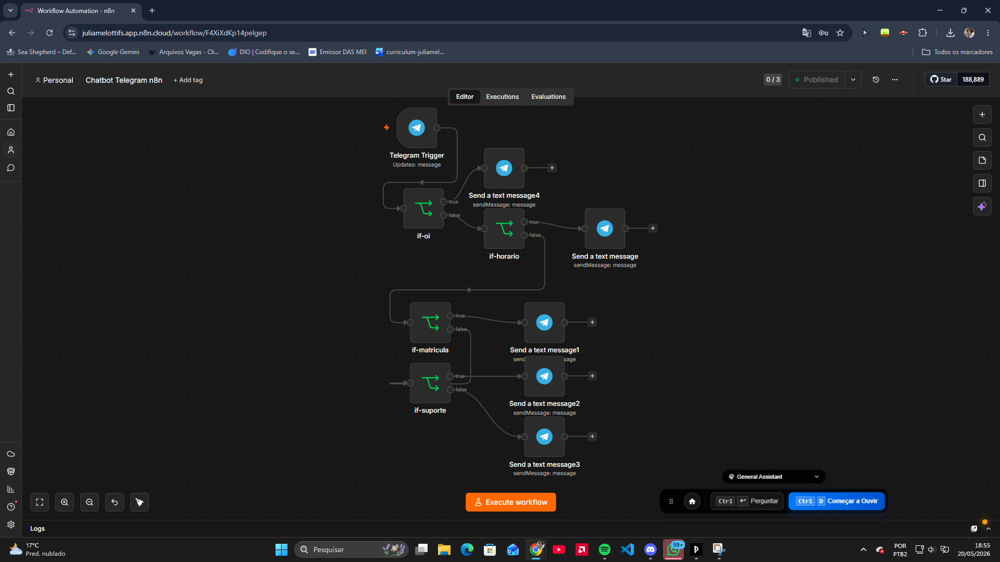

# n8n-telegram-chatbot
Chatbot simples de atendimento usando n8n e Telegram

Chatbot de Atendimento com n8n + Telegram

Projeto simples de automação utilizando n8n e Telegram para simular um chatbot de atendimento digital.

 🚀 Funcionalidades

* Respostas automáticas no Telegram
* Fluxo condicional com IF
* Atendimento para:

  * horário
  * matrícula
  * suporte
* Estrutura de chatbot no-code

🛠️ Ferramentas utilizadas

* n8n
* Telegram Bot
* Lógica condicional (IF)
* Automação no-code

 📚 Objetivo

Praticar automação de fluxos, integração com Telegram e construção de chatbots simples voltados para atendimento digital.

📸 Fluxo do Chatbot

